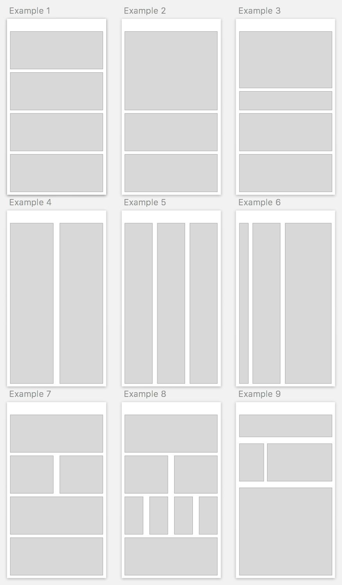

# Styles

## Intro 

Styling React native is similar to styling web pages. Most CSS styles are 
supported. You will not attach a style sheet. Instead you will include styles
with each component as a JavaScript Object. All Style names are camel case 
equivalents to names used in CSS. 

## Flex box

Positioning and layout are handled with flex box. While you can use position to 
position elements flex box is, well, more flexible in most situations. You will 
want to use it often. 

## Font styles 

## Colors 

## Examples

## Challenges 

- Recreate the examples in the image below. You should be able to accomplish this
using Flex Box. Don't worry about matching the to the pixel. Just get the general
layout to follow each of the examples. 

- 